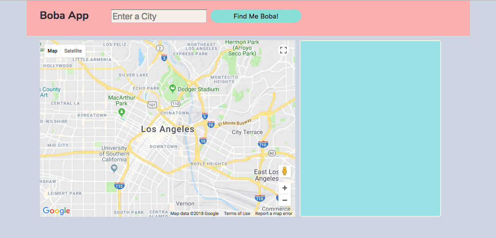
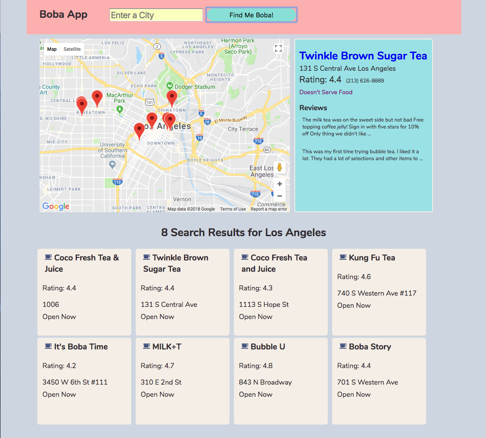

<h1>Boba App</h1>

<a href="https://khriskempis.github.io/bobaApp/">Check out Website</a>

The Boba App will serve all of your milk tea and boba cravings! Simply enter a city and the helpul map will populate with different venues that serve milk tea and boba surrounding the selected city. 
 

You can click on any of the markers and a detailed list of information will be displayed in the right hand section. Details such as address, rating, phone number, and some sample reviews will be displayed for your conveniece.
 

Also a list of your search results will be displayed below the map so that you can have a quick overview of the difference milk tea and boba places are in the city. 

For this project I used HTML, CSS, Javascript, and jQuery.
