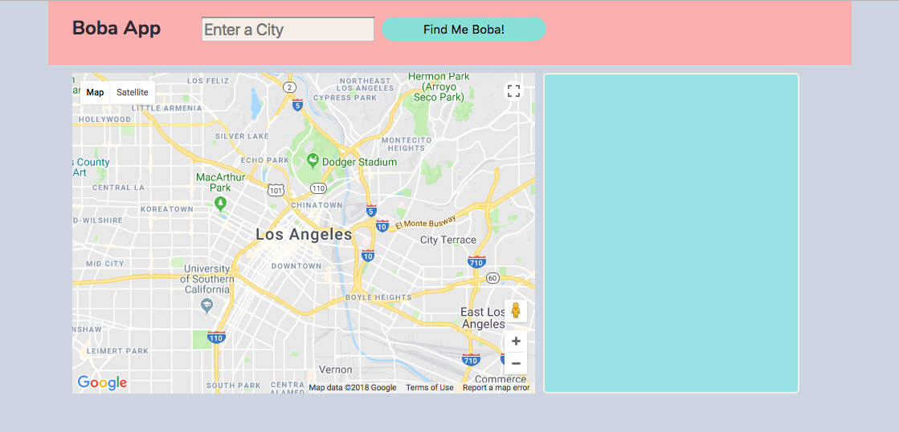
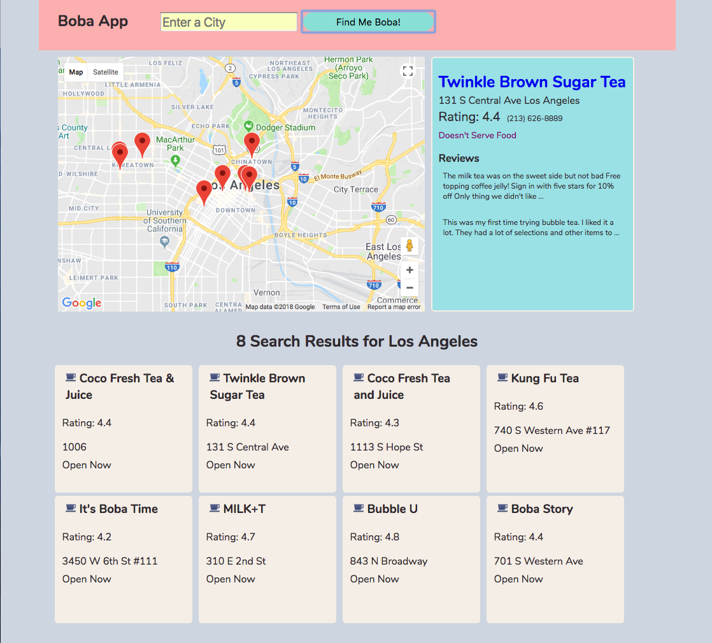

<h1>Boba App</h1>

<a target="_blank" href="https://khriskempis.github.io/bobaApp/">Check out Website</a>

<em>This application requires CORS to be enabled. 
If you experience problems please make sure your browser supports CORS.</em>

The Boba App will serve all of your milk tea and boba cravings! 
Simply enter a city and a helpful map will populate with different venues that serve milk tea and boba surrounding the selected city.  

 

You can click on any of the markers and a detailed list of information will be displayed in the right hand section. 
Details such as address, rating, phone number, and some sample reviews will be displayed for your conveniece. 

 

Also a list of your search results will be displayed below the map so that you can have a quick overview of the different milk tea and boba places in the city. 

For this project I used: 
<ul>
	<li>HTML</li>
	<li>CSS</li>
	<li>Javascript</li>
	<li>jQuery</li>
</ul>

